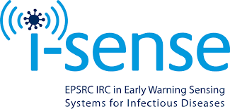

# *i-sense* cost-effectiveness model 

<!--  -->

   

## Introduction

[i-sense](https://www.i-sense.org.uk/) aims to identify outbreaks of
infectious disease much earlier than ever before, helping patients gain
faster access to care and protecting populations. Funded by the EPSRC,
i-sense is an Interdisciplinary Research Collaboration (IRC) dedicated
to supporting a strong team of professionals with different expertise
and experience.

## Structure

The key steps of the analysis pipeline are:

  - Tidy data to same levels, dates etc

  - Tidy, arrange and calc numbers and probs of individuals
    
      - up to service use
      - after service use

  - Calculate population counts for each scenario

  - Calculate transition matrix for each scenario

  - Calculate cost-effectiveness for each scenario
